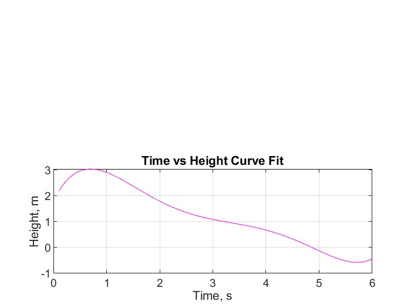
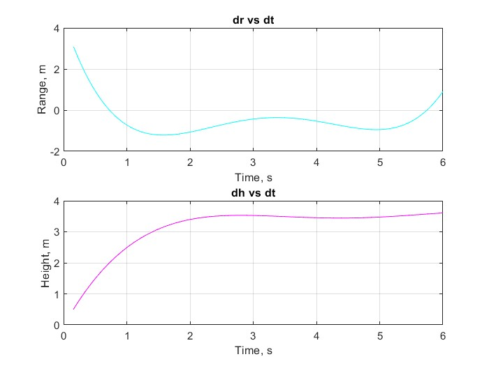

# AEM-3103-Final-Project-2024
This is the final project for the class AEM 3103 at the U of M, Twin Cities. This project was assigned to my team during the Spring 2024 Semester.

# Paper Airplane Numerical Study
Final Project: AEM 3103 Spring 2024

- By: Lani Calderon, Keenan Raby, Justin Lancisi
  
## Summary of Findings
<Show the variations studied in a table>
| Attempt | #1    | #2    |
| :-----: | :---: | :---: |
| Seconds | 301   | 283   | 

Summarized what was accomplished in this study.  Describe 2-4 observations from simulating the flight path.
Reference the figures below as needed.

We successfully implemented several numerical methods to analyze the flight performance of a paper airplane under different parameters and were able to study how the affected the overall glide characteristics

*If the analysis falls short of the goal, this is your chance to explain what was done or what were the barriers.*

# Code Listing
A list of each function/script and a single-line description of what it does.  The name of the function/script should link to the file in the repository on GitHub.

[EqMotion](EqMotion.m)

This function solves for xdot based on the global variables of the given parameters for our scenario.

[PaperPlane](PaperPlane.m)

This is the main script that runs all of the graphing and computation needed for the project.

# Figures

## Fig. 1: Single Parameter Variation

<2D trajectory simulate2d by varying single parameter at at time>
<The above plot should also show the nominal trajectory>

This figure compares glides of different velocities and different flight path angles and how they vary the height and range when you stray from nominal values (black lines).

## Fig. 2: Monte Carlo Simulation

<2D trajectories simulated using random sampling of parameters, overlay polynomial fit onto plot.>

This graph shows the resulting glide from 100 different iterations of random parameters from which you can visually extract the general behavior of the system under different conditions.

## Fig. 3: Time Derivatives

<Time-derivative of height and range for the fitted trajectory>
This figure shows the derivative of the height and range as a function of time based on the Figure one curve fitting from the Monte Carlo Simulation

(Below are for teams of 2-3 people)

# Animation
## Point-Mass Animation
<Animated GIF showing 2D trajectory for nominal and the scenario (V=7.5 m/s, Gam=+0.4 rad)>

(Below are for teams of 3 people)
## Graphical Animation
<Same as the above animation, except that the moving *point* should be a 2D drawing of an airplane, drawn using CAD>
