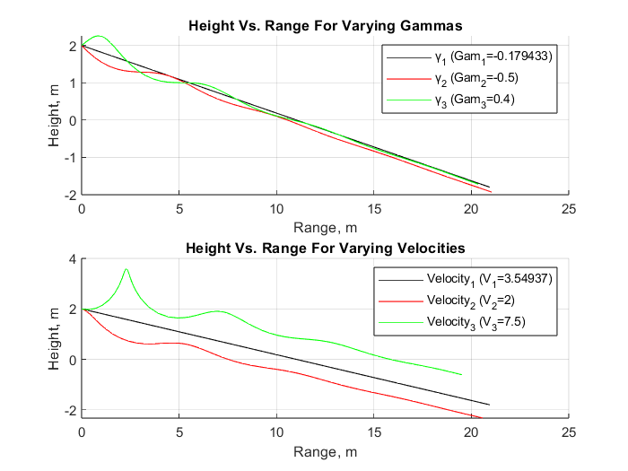
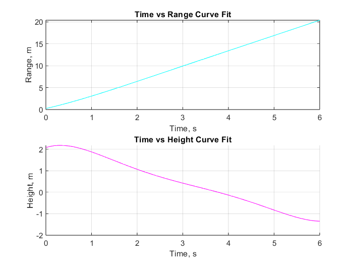
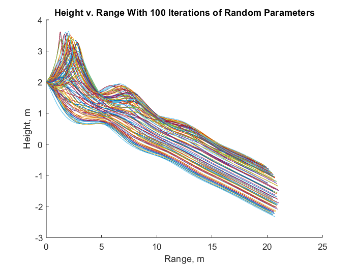
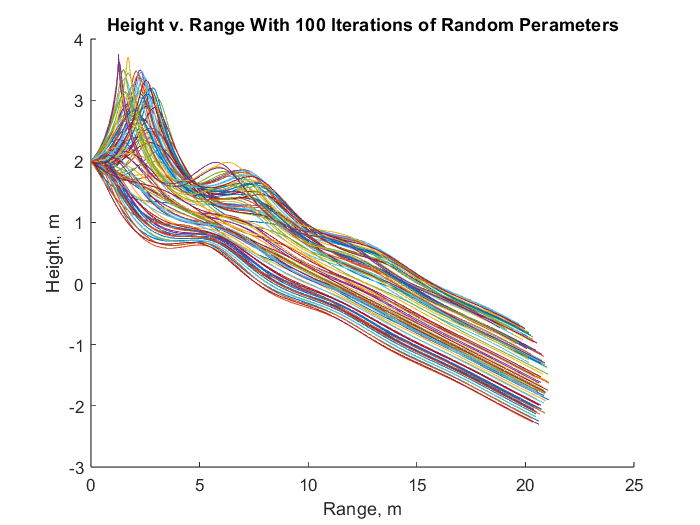
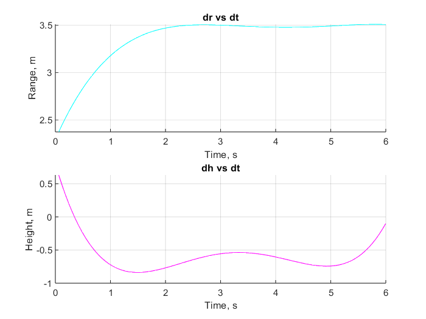
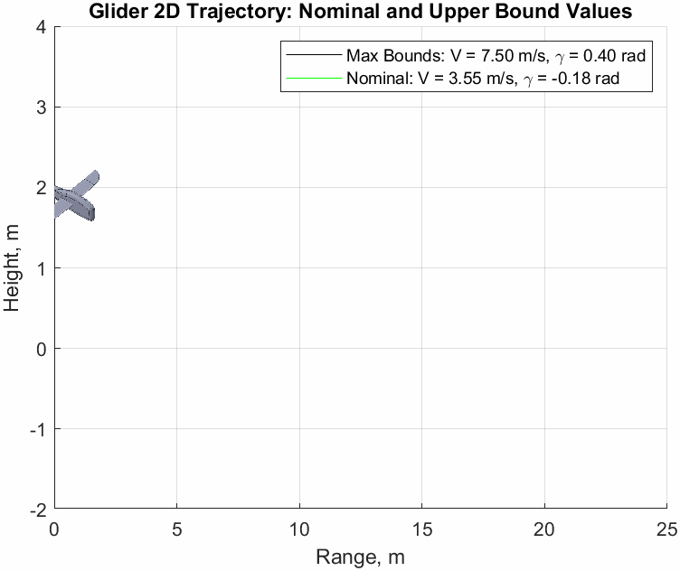

# AEM-3103-Final-Project-2024
This is the final project for the class AEM 3103 at the U of M, Twin Cities. This project was assigned to my team during the Spring 2024 Semester.

# Paper Airplane Numerical Study
Final Project: AEM 3103 Spring 2024

- By: Lani Calderon, Keenan Raby, Justin Lancisi
  
## Summary of Findings

When varying the velocities and gammas the impact on the range was indentified. Looking at the plotted data below, it was determined that the maximum values yielded the best range
possible for velocity compared to the minimum values. However, for the gamma plots, the nominal value was ideal compared to both the maximums and minimums. The nominal values are presumed to be the ideal for the paper airplane's flight.  
Reference the figures below as needed.

| Values  | Velocity    | Gamma  | 
| :-----: | :---------: | :----: | 
| Minimum |   2 m/s     | -0.5   |
| Nominal |  3.55 m/s   | -0.18  |
| Maximum |  7.5 m/s    |  0.4   |

We successfully implemented several numerical methods to analyze the flight performance of a paper airplane under different parameters and were able to study how the affected the overall glide characteristics

# Code Listing
A list of each function/script and a single-line description of what it does.  The name of the function/script should link to the file in the repository on GitHub.

[EqMotion](EqMotion.m)

This function solves for xdot based on the global variables of the given parameters for our scenario.

[PaperPlane](PaperPlane.m)

This is the main script that runs all of the graphing and computation needed for the project.

# Figures

## Fig. 1: Single Parameter Variation

<2D trajectory simulate2d by varying single parameter at at time>
<The above plot should also show the nominal trajectory>

This figure compares glides of different velocities and different flight path angles and how they vary the height and range when you stray from nominal values (black lines).

## Fig. 2: Monte Carlo Simulation

<2D trajectories simulated using random sampling of parameters, overlay polynomial fit onto plot.>

This graph shows the resulting glide from 100 different iterations of random parameters from which you can visually extract the general behavior of the system under different conditions.

## Fig. 3: Time Derivatives

<Time-derivative of height and range for the fitted trajectory>

This figure shows the derivative of the height and range as a function of time based on the Figure one curve fitting from the Monte Carlo Simulation

## Graphical Animation
<Same as the above animation, except that the moving *point* should be a 2D drawing of an airplane, drawn using CAD>
 
 
